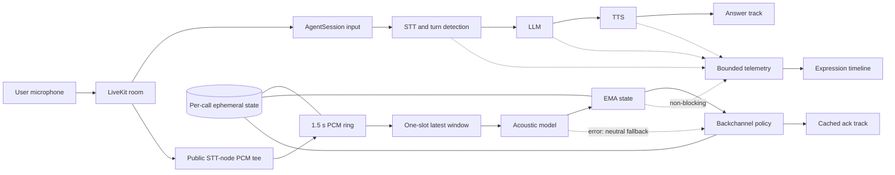

# Streaming acoustic intelligence: design and production plan

## Prototype

The public LiveKit STT node tees incoming PCM into `StreamingAcoustics` before yielding the same frames unchanged to STT. Acoustic inference runs in its own task and is independent of turn detection, LLM and TTS. The processor keeps at most 1.5 seconds of 16 kHz mono PCM, submits a window every 250 ms after 750 ms of speech, and retains only one waiting inference. Slow inference replaces old waiting windows instead of building a backlog.

`prosody-dsp-v1` is an interpretable CPU baseline. It measures voiced energy, pauses, frame-energy variation and zero-crossing roughness. It emits uncalibrated energy, uncertainty and frustration cues and never reads transcript text. EMA smoothing (`alpha=0.35`) reduces adjacent-window flicker; confidence grows with usable voiced audio. These values describe delivery, not a person's true emotional state.

This baseline is deterministic, runs locally in under 1 ms, and proves the streaming and failure-handling design without adding a network dependency. It is not a validated emotion recognizer. A production model should keep the same interface but be calibrated on consented, multilingual, target-domain human speech.

The earliest trusted output is 750 ms of audio; full context stabilizes at 1.5 seconds. Effective detection latency is `relevant audio accumulation + queue wait + inference + transport`, not inference time alone.

## Architecture and failure boundaries

The normal-response chain is the critical path. Acoustic inference, backchanneling, analytics and UI are non-critical. The normal response never awaits acoustic work. If the reader, model, telemetry or acknowledgement fails, STT, EOT, LLM and TTS continue; policy falls back to neutral behavior.

The signal changes one real decision. When smoothed frustration is at least 0.82, uncertainty at least 0.45 and confidence at least 0.45, acknowledgement cooldown rises from 4.5 to 7.875 seconds and `go on` becomes `mm-hmm`. Requiring two cues reduces false reactions to naturally energetic delivery. This is a prototype threshold. Measure benefit with blinded ratings of intrusiveness plus acknowledgement counts on frustrated speech.

## Backpressure, failures and shutdown

Audio arrives in 20 ms frames. The SDK stream is capped at 20 frames. The processor holds a fixed 48 KB PCM window and one pending request. If inference slows from 40 ms to 300 ms while stride is 250 ms, the waiting item is replaced with the newest window. A completed result is discarded if a newer window was submitted. Memory stays bounded and predictions stay current at the cost of temporal resolution. Counters expose replaced and stale windows.

Speech stop clears the ring, waiting work and smoothing state, and invalidates in-flight results. Disable does the same. Shutdown cancels the model worker; LiveKit owns the original input stream. Model exceptions emit `acoustic_failed`; telemetry failure does not stop audio processing.

## Measurements and evidence

The benchmark contains nine owned TTS fixtures: identical words with positive and frustrated delivery, increasing frustration, hesitation, high energy, flat delivery, seeded noise, a long changing turn and Hinglish. WAV hashes and generation metadata are committed. Five passes measured inference P50 **0.30 ms** and P95 **0.66 ms** on the development laptop. The first signal requires 750 ms, so startup detection is approximately **750.3 ms P50** plus transport; steady updates use a 250 ms stride.

For “Yeah, that's great.” the text baseline is identical for both deliveries. The acoustic frustration cue differed by **0.039** and energy by **0.054** in the expected direction. This shows audio adds some information, but separation is small and synthetic speech cannot establish accuracy on people. Noise changes the cues materially, so no robustness claim is made.

Live replay aligns worker and receiver monotonic clocks. Predictions record inference, audio accumulation and worker-to-receiver transport. `python -m backchannel.acoustic_replay --repeats 2` pairs acoustic OFF/ON on identical WAVs and reports response P50/P95, EOT, LLM TTFT, TTS first audio and acoustic transport. Hardware speaker/display latency remains outside measurement.

The committed LiveKit Cloud run contains six complete pairs and twelve successful calls across long, fast and noisy speech. Acoustic OFF/ON response P50 was **3,360.6/3,671.4 ms**, P95 was **3,770.4/4,040.0 ms**, and the paired mean delta was **+299.1 ms**. ON runs measured acoustic inference **0.76 ms P50** and worker-to-receiver transport **123.8 ms P50**. The response delta exceeds the proposed 30 ms production gate. With only two repetitions per scenario on shared providers, it is a regression signal to investigate rather than evidence that the non-blocking analyzer caused the difference; production promotion requires at least 20 randomized pairs per scenario and stage-level comparison. Raw events and failures are retained in `results/acoustic-livekit.json`.

## Per-call state

Ephemeral worker memory holds the 48 KB audio ring, one waiting window, EMA vector, confidence, latest window ID, counters, expression history, turn state, cooldown and pending acknowledgement. It is safe to lose: a replacement starts neutral and rebuilds acoustic context within 1.5 seconds. Durable conversation history and tenant config remain in their existing services. Call-end cleanup cancels tasks and releases buffers. This component persists no raw audio.

## Model serving and capacity

Keep PCM framing and normalization on call workers. Route inference by tenant and call ID to a regional model service with per-tenant weighted-fair queues, latest-window keys, deadlines, model versions and small dynamic batches. A batch waits at most 10-20 ms; expired work is dropped. Scale on queue age, deadline misses and GPU utilization.

At four windows/second/call, 1,000 calls produce 4,000 windows/s and 10,000 produce 40,000. At the measured 0.30 ms CPU time/window, inference uses about 1.2 and 12 CPU-seconds/second. A 2x safety factor suggests roughly 3 and 24 inference cores, excluding call-worker overhead. Raw rings need about 48 MB and 480 MB; budgeting 64 KB total acoustic state/call gives 64 MB and 640 MB.

For an illustrative GPU model processing batch 32 in 5 ms, theoretical throughput is 6,400 windows/s. At 60% planned utilization it is 3,840. Roughly 2 GPUs cover 1,000 calls with headroom; 11 cover 10,000, or 15 with 30% failure/traffic headroom. These are formulas, not measured GPU counts.

At 100,000 calls, 4 Hz means 400,000 windows/s. First reduce acoustic cadence to 1 Hz, then disable backchannel adaptation, then acoustic inference. Core media, STT/EOT and responses retain capacity. Analytics sampling degrades before conversation features.

## Spikes, tenants and deployment

During a 4,000-to-12,000-call spike, reserve capacity in this order: media/EOT, STT, LLM/TTS, base backchannel safety, acoustics, analytics. The acoustic service sheds expired work and reduces cadence instead of queueing old audio. Weighted-fair queues and per-tenant stream/window quotas prevent one tenant taking all capacity.

Tenant configuration contains model version, enable flag, cadence, thresholds, acknowledgement set, language calibration, retention and deployment policy. Bank A gets conservative thresholds, Retailer B a shorter cooldown, Customer C disables acoustics, Customer D uses multilingual calibration, and Customer E points the same interface at an on-prem endpoint. No forks are required.

Blue Machines Cloud uses managed regional services. Customer VPC adds private endpoints, customer keys and exported metrics. Air-gapped deployments package LiveKit, STT, LLM, TTS and acoustic models locally, use an offline signed registry, local observability and staged offline upgrades; external fallbacks are disabled.

## Observability and rollout

Every call carries tenant, room/call, participant, turn, acoustic window, backchannel decision, response request, worker version and model version IDs. Histograms cover media jitter/drops, acoustic queue age/inference/effective/transport latency, stale rate, STT finalization, EOT, LLM TTFT, TTS first audio and response onset. Traces connect stages; resource metrics cover CPU, memory, GPU, batch size, queue age and deadline misses. This splits a 2:00-2:10 slowdown by stage, tenant, region, worker and model replica.

A new model shadows without behavior changes, then canaries at 1%, 5%, 25%, 50% and 100% with tenant opt-in and pinned versions. Stop or roll back if response P95 regresses over 30 ms, acoustic deadline misses exceed 1%, stale drops double, cue distributions drift, acknowledgement collisions/intrusiveness worsen, or crashes rise. A +35 ms model ships only when measured quality gains justify added effective latency.

## Direct answers

1. The CPU DSP baseline is audio-only, deterministic, cheap and replaceable.
2. Output begins at 750 ms; stability improves through 1.5 seconds.
3. True startup latency is 750 ms audio plus queue, inference and transport.
4. The model receives PCM only; identical text produces different acoustic values while text sentiment is identical.
5. EMA limits adjacent changes; every window is retained in benchmark traces.
6. Noise changes cues, so the prototype makes no noise-robustness claim.
7. Features are non-lexical, but accent/language fairness is unvalidated; Hinglish is only a smoke test.
8. Separate tasks, bounded buffers and no response-path await isolate inference.
9. Waiting windows are replaced and completed stale predictions discarded.
10. At 10,000 calls, provider/model throughput is likely to fail before acoustic-ring memory.
11. At 100,000, shard by region/tenant, reserve core capacity and lower acoustic cadence.
12. Disable verbose analytics first, then acoustic adaptation/inference; keep core conversation last.
13. Durable history, tenant config and experiment assignment need recovery; acoustic windows and EMA do not.
14. Air-gapped deployment replaces external APIs with packaged local services, keys, metrics and signed upgrades.
